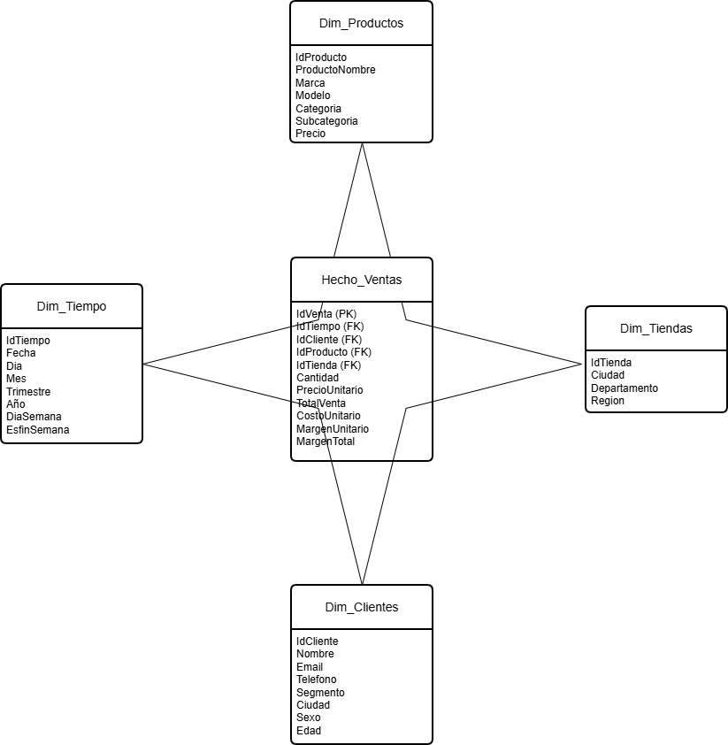
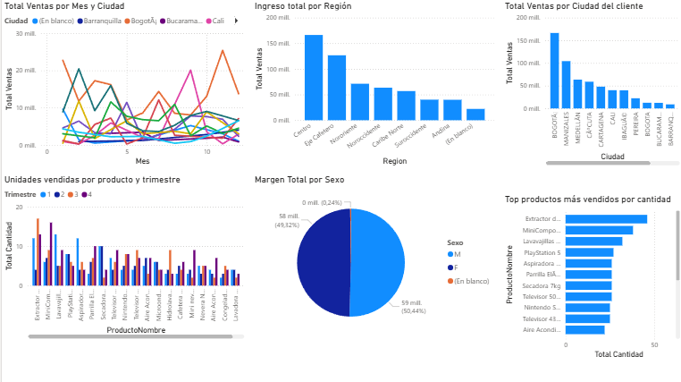

# 📊 ETL, Data Warehouse y Dashboards en Power BI

## Descripción

Proyecto académico enfocado en el diseño e implementación de una solución de Business Intelligence para la empresa ficticia **ElectroHogar S.A.S.**

La organización presentaba dificultades para analizar información debido a que sus datos se encontraban distribuidos en múltiples archivos CSV con inconsistencias, valores nulos y formatos no estandarizados.

Como solución se diseñó e implementó un proceso **ETL**, un **Data Warehouse en MySQL** y una serie de **dashboards en Power BI** para facilitar el análisis de información y apoyar la toma de decisiones.

---

## Objetivos

- Centralizar información dispersa.
- Garantizar la calidad de los datos.
- Automatizar procesos de transformación.
- Facilitar el análisis multidimensional.
- Generar indicadores de negocio mediante Power BI.

---

## Tecnologías utilizadas

- MySQL
- SQL
- Power BI
- ETL
- Modelado Dimensional

---

# Etapa 1: Diseño de la Estrategia BI

## Problema identificado

ElectroHogar S.A.S. almacenaba información en múltiples archivos CSV, generando:

- Duplicidad de datos.
- Procesos manuales.
- Inconsistencias en la información.
- Dificultades para generar reportes confiables.

## Solución propuesta

- Implementación de un Data Warehouse.
- Diseño de un modelo estrella.
- Automatización mediante procesos ETL.
- Construcción de dashboards interactivos en Power BI.

---

# 🗄️ Etapa 2: Implementación del Data Warehouse

## Modelo Dimensional

## Transformaciones realizadas

- Limpieza de valores nulos.
- Eliminación de espacios en blanco.
- Estandarización de formatos.
- Validación y corrección de datos inconsistentes.

---

# 📈 Etapa 3: Visualización y Análisis

## Dashboard principal

## Indicadores generados

- Ventas por ciudad.
- Ventas por región.
- Productos más vendidos.
- Ingresos por segmento de clientes.
- Unidades vendidas por producto.

---

## Hallazgos principales

- Identificación de las ciudades con mayor volumen de ventas.
- Detección de productos con mayor rotación.
- Identificación de regiones con mejor desempeño comercial.
- Análisis de segmentos de clientes con mayor rentabilidad.
- Identificación de tendencias de ventas por periodo.

---

# Resultados obtenidos

- Centralización de información proveniente de múltiples fuentes.
- Mejora en la calidad y consistencia de los datos.
- Automatización del proceso de transformación.
- Generación de reportes interactivos para análisis de negocio.
- Reducción de la dependencia de procesos manuales.

---

## Contenido del repositorio

- `/sql` → Scripts de creación del Data Warehouse y procesos ETL.
- `/powerbi` → Archivo PBIX y documentación de reportes.
- `/images` → Diagramas y capturas utilizadas en el proyecto.
- `/docs` → Documentación complementaria.

---

## Autor

**Jeikson Bedoya Gómez**

Proyecto desarrollado como parte de la formación en Ingeniería de Sistemas.
